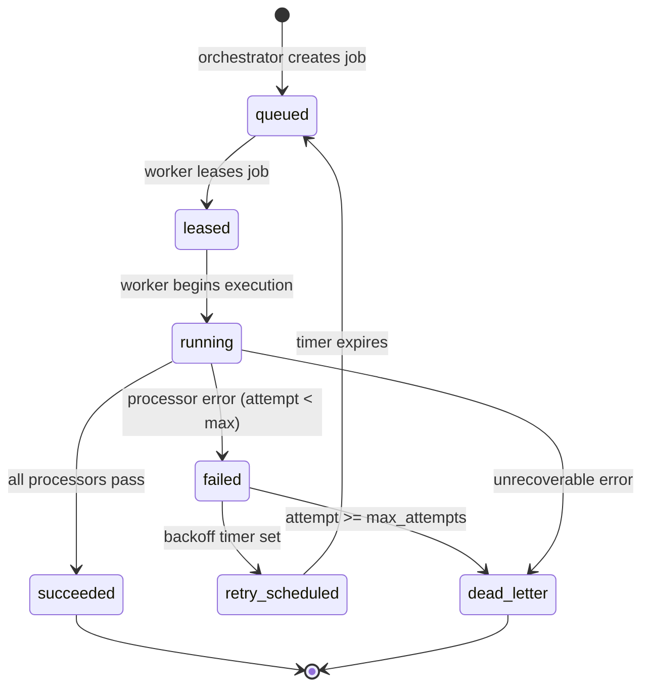

# Architecture

## System Overview

Runeforge is a pipeline of loosely-coupled microservices connected by NATS JetStream. Each service owns a single responsibility. The platform ingests tasks from external sources, runs LLM-driven analysis, produces human-reviewable proposals, and (when approved) writes changes back to the source system — all with a full, append-only audit trail.

```
External Sources                     Runeforge Platform                  Admin UI
─────────────────    ─────────────────────────────────────────────────   ────────
Google Tasks ──────► source-sync ──► orchestrator ──► worker ──► writeback
                          │               │               │          │
                          └───────────────┴───────────────┴──────────┘
                                        NATS JetStream
                                        PostgreSQL
                                        api-gateway ◄────────────────── admin-web
```

## Component Diagram

```
┌─────────────────────────────────────────────────────────────────────┐
│                         NATS JetStream                               │
│  Subjects: runeforge.source.task.*, runeforge.job.*,                 │
│            runeforge.proposal.*, runeforge.writeback.*,              │
│            runeforge.notify.*                                        │
└──────────┬──────────────────────────────────────────────────────────┘
           │  pub/sub
  ┌────────┴────────────────────────────────────────────────┐
  │                                                         │
  ▼                                                         ▼
source-sync          orchestrator          worker         writeback
─────────────        ────────────          ──────         ─────────
Polls Google         Subscribes to         Leases jobs    Executes
Tasks API.           task.detected &       from queue.    approved
Detects new          task.changed.         Runs LLM       proposals
and changed          Creates               processors.    back to
tasks.               ProcessingJobs.       Publishes      Google Tasks.
Publishes            Publishes             proposals.     Verifies
detected/            job.created.                         result.
changed events.

  ▼
notification
────────────
Subscribes to
notify.requested.
Sends webhook /
email alerts.

api-gateway
───────────────────────────────────────────────────────────────────
REST API over PostgreSQL. CRUD for source connections, tasks, jobs,
proposals, writeback operations. Admin-Token authentication.
Exposes /health and /metrics endpoints.

admin-web
─────────────────────────────────────────────────────────────────
React SPA for reviewing proposals, managing connections, monitoring
job queues, and approving/rejecting suggestions.
```

## Why Sync and Processing Are Decoupled (CRITICAL)

**Source sync** and **task processing** are intentionally separate services with separate concerns:

| Concern | source-sync | orchestrator + worker |
|---|---|---|
| **Responsibility** | Faithfully mirror the external source | Apply intelligence to mirrored data |
| **Trigger** | Time (poll interval) or webhook | Event-driven (task detected/changed) |
| **Failure blast radius** | LLM outage has zero effect on sync | Source API outage has zero effect on jobs |
| **Retry semantics** | Re-poll next interval | Independent job retry with backoff |
| **Data ownership** | source_tasks, snapshots | processing_jobs, runs, proposals |

This decoupling means:
- A spike in LLM latency never causes task syncs to fall behind.
- The Google Tasks API being slow never blocks proposal review.
- Each service can be scaled, restarted, or replaced independently.
- The sync service is a pure mirror; it never mutates source data.

## Job Lifecycle State Machine



## Source of Truth Model

```
source_connection (1)
      │
      ├── source_task (N)          ← current state, mirrored from source
      │       │
      │       └── source_task_snapshot (N)  ← append-only history, used for change detection
      │
      └── (triggers via event)
              │
              ▼
        processing_job (N)         ← queued work item
              │
              └── processing_run (N)    ← one record per attempt

processing_job ──► suggestion_proposal (N)    ← LLM output awaiting review
suggestion_proposal ──► writeback_operation (1)  ← approved, executed against source
```

## Writeback Model

1. Worker produces a `SuggestionProposal` with `approval_status = pending`.
2. If `FEATURE_AUTO_APPROVE=true`, the orchestrator auto-approves; otherwise a human approves via admin-web.
3. On approval, a `ProposalApprovedEvent` is published on `runeforge.proposal.approved`.
4. The writeback service receives the event, creates a `WritebackOperation`, and calls the source provider API.
5. After the write, the writeback service re-reads the record from the source and sets `verified = true` if the change is reflected.
6. `WritebackCompletedEvent` or `WritebackFailedEvent` is published.

**Writeback is idempotent**: if the operation is retried (e.g., after a crash), the writeback service checks the current source state before writing.

## Provider Abstraction

All LLM calls go through the `providers.Provider` interface:

```go
type Provider interface {
    Complete(ctx context.Context, req CompletionRequest) (CompletionResponse, error)
    Name() string
}
```

Implementations: `openai`, `openrouter`, `ollama`. The worker selects a provider at startup via configuration. Adding a new provider requires implementing only this interface — no other service changes.

Similarly, all source integrations go through the `source.Connector` interface:

```go
type Connector interface {
    FetchAll(ctx context.Context) ([]RawTask, error)
    FetchSince(ctx context.Context, since time.Time) ([]RawTask, error)
    WriteBack(ctx context.Context, op WritebackOp) error
    Provider() string
}
```

## Admin UI Purpose

The admin-web is a **human-in-the-loop interface**, not a management console. Its primary job is:
- Show pending `SuggestionProposal` records with diff views (original vs proposed).
- Allow one-click approve/reject with optional comment.
- Provide a job queue monitor (status breakdown, error messages).
- Show audit events for full traceability.

## Message Flow Diagram

```
source-sync                 NATS                    orchestrator           worker
    │                         │                          │                   │
    │── task.detected ────────►│──────────────────────────►│                   │
    │                         │                          │── create job       │
    │                         │                          │── job.created ─────►│
    │                         │                          │                   │── lease job
    │                         │                          │                   │── run processors
    │                         │                          │                   │── proposal.created
    │                         │◄── proposal.approved (admin UI) ─────────────│
    │                         │                          │                   │
    │                         │──────────────────────────────────────────────►writeback
    │                         │                                               │── call source API
    │                         │                                               │── writeback.completed
    │◄── re-sync detects change (verify) ─────────────────────────────────────│
```
